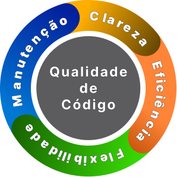

# DOCUMENTAÇÃO - TRABALHO DR2 TP1
## Refatoração de 12 Códigos Java com Clean Code

```
═════════════════════════════════════════════════════════════════════════
  Escola Superior de Tecnologia da Informação - Instituto Infnet
  https://www.infnet.edu.br/

  Bloco: Engenharia Disciplinada de Softwares
  Disciplina: Engenharia de Software: Clean Code e Boas Práticas [DR2]
  Trabalho: Teste de Performance 1 [TP1]
  Professor: Rafael Bento Cruz
  Aluno: André Luis Becker
  Entrega: 11/11/2025
═════════════════════════════════════════════════════════════════════════
```

## Sumário

1. [Visão geral](#1-visão-geral)
2. [Objetivo do trabalho](#2-objetivo-do-trabalho)
3. [Metodologia](#3-metodologia)
4. [Estrutura do projeto](#4-estrutura-do-projeto)
5. [Análise dos 12 exercícios](#5-análise-dos-12-exercícios)
6. [Princípios e práticas aplicadas](#6-princípios-e-práticas-aplicadas)
7. [Testes unitários](#7-testes-unitários)
8. [Conclusão](#8-conclusão)
9. [Referências](#9-referências)

---

## 1. Visão geral

Este trabalho apresenta a refatoração de 12 códigos Java que apresentavam problemas estruturais. O objetivo foi aplicar princípios de engenharia de software bem estabelecidos, como Clean Code (Robert C. Martin), SOLID e boas práticas gerais.

Durante o desenvolvimento, percebi que código limpo não é apenas sobre "fazer funcionar", mas sobre escrever algo que outras pessoas (ou você mesmo depois de 6 meses) consigam entender rapidamente e modificar com segurança.

---

## 2. Objetivo do trabalho

- Entender e aplicar princípios de SRP, SOLID, DRY, KISS, YAGNI
- Praticar separação em camadas (modelo, serviço, apresentação)
- Aprender a escrever validações e tratamento de erros estruturado
- Colocar em prática testes automatizados como garantia de qualidade
- Documentar as decisões de design de forma clara

---

## 3. Metodologia

Para cada exercício, segui um padrão:

1. **Análise** do código original → identificar os problemas
2. **Planejamento** → decidir como refatorar seguindo princípios
3. **Implementação** → escrever o código novo
4. **Testes** → garantir que funciona e é testável
5. **Documentação** → explicar por que fiz assim

Isso não significa que cada decisão foi perfeita, mas tentei ser consciente do que estava fazendo e por quê.

---

## 4. Estrutura do projeto

```
projetoDR2_TP1/
├── pom.xml                           # Build e dependências (Maven)
├── README.md                         # Visão geral e instruções
├── .gitignore                        # Exclusões do Git
│
├── src/main/java/infnet/andreDR2_TP1/
│   ├── Application.java              # Menu para rodar exercícios
│   └── exercicios/
│       ├── Ex01.java    (Sistema Financeiro)
│       ├── Ex02.java    (Processador de Dados)
│       ├── Ex03.java    (Carrinho de Compras)
│       ├── Ex04.java    (Biblioteca)
│       ├── Ex05.java    (Banco)
│       ├── Ex06.java    (Relatório)
│       ├── Ex07.java    (Conta - Validações)
│       ├── Ex08.java    (Pedido - Comentários)
│       ├── Ex09.java    (Processador - Formato)
│       ├── Ex10.java    (Serviço - Erros)
│       ├── Ex11.java    (Validador CPF)
│       └── Ex12.java    (Pagamento - Exceções)
│
└── src/test/java/infnet/andreDR2_TP1/
    └── exercicios/
        └── Exercicios01a12Tests.java (46 testes)
```

---

## 5. Análise dos 12 exercícios

Antes de entrar nas análises específicas, vale entender os **quatro objetivos fundamentais** que todo código de alta qualidade deve alcançar:

### 🎯 Os 4 Objetivos de Código de Alta Qualidade



1. **Manutenção** - O código deve ser fácil de manter e evoluir ao longo do tempo
2. **Clareza** - O código deve comunicar sua intenção de forma cristalina
3. **Eficácia** - O código deve resolver o problema de forma correta e eficiente
4. **Flexibilidade** - O código deve se adaptar facilmente a mudanças de requisitos

Esses quatro pilares guiaram todas as refatorações que fiz. Agora vamos aos exercícios:

---

### Exercício 01 - Sistema Financeiro

**📋 Tarefa:**
a) Explique três problemas estruturais neste código.
b) Justifique por que esses problemas impactam a qualidade e manutenção do software.

#### Análise do código original:

```java
private List contas;    // Lista de nomes (String)
private List valores;   // Lista de saldos (Double)
```

#### a) Três problemas estruturais identificados:

**1. Listas paralelas desacopladas**
O código mantém duas listas separadas (`contas` e `valores`) que precisam estar sempre sincronizadas. Se eu adicionar um elemento em uma e esquecer da outra, o sistema quebra silenciosamente. Isso viola o princípio de coesão - dados que andam juntos deveriam estar juntos.

**2. Acoplamento direto ao console**
O método `gerarRelatorio()` imprime diretamente no console com `System.out.println()`. Isso torna impossível testar o comportamento sem capturar a saída padrão. Além disso, se eu quiser gerar o relatório em outro formato (PDF, JSON), preciso reescrever tudo.

**3. Falta de encapsulamento**
Não existe uma entidade "Conta" no código. O conceito está espalhado em duas listas diferentes. Isso dificulta entender o que é uma conta e quais operações ela suporta.

#### b) Impacto na qualidade e manutenção:

**Manutenção comprometida:** Se precisar adicionar um novo campo (como "tipo de conta"), teria que criar uma terceira lista e lembrar de mantê-las sincronizadas em todos os lugares. A complexidade cresce exponencialmente.

**Testabilidade prejudicada:** Como testar se o relatório está correto se ele imprime direto no console? Precisaria de hacks como redirecionar System.out, o que torna os testes frágeis.

**Extensibilidade limitada:** Quer processar taxas diferentes por tipo de conta? Quer gerar relatórios em formatos diferentes? Com a estrutura atual, isso vira um pesadelo rapidamente.

#### Solução implementada:

```java
// Agora cada conta é uma entidade coesa
public static class ContaFinanceira {
    private final String titular;
    private double saldo;

    public ContaFinanceira(String titular, double saldoInicial) {
        this.titular = titular;
        this.saldo = saldoInicial;
    }

    public void descontarTaxa(double taxa) {
        this.saldo -= taxa;
    }

    public String formatarLinha() {
        return String.format("Conta: %s - Saldo: R$ %.2f", titular, saldo);
    }
}

private final List<ContaFinanceira> contas = new ArrayList<>();

// Desacoplado do console - retorna dados
public List<String> gerarRelatorio() {
    return contas.stream()
            .map(ContaFinanceira::formatarLinha)
            .collect(Collectors.toList());
}
```

**Princípios aplicados:** SRP (responsabilidade única), encapsulamento, desacoplamento de I/O.

---

### Exercício 02 - Processador de Dados

**📋 Tarefa:**
a) Explique como este código falha em atingir os quatro objetivos de um código de alta qualidade:
   - a.a) Legibilidade
   - a.b) Redução de duplicação
   - a.c) Facilidade de modificação
   - a.d) Eficácia na comunicação

#### Análise do código original:

```java
public void processar(String dado) {
    if (dado != null && !dado.isEmpty()) {
        if (dado.length() > 10) {
            System.out.println("Dado válido: " + dado);
        } else {
            System.out.println("Dado muito curto.");
        }
    } else {
        System.out.println("Dado inválido.");
    }
}
```

#### a.a) Legibilidade

O código usa **IFs aninhados**, o que força o leitor a manter múltiplos contextos na cabeça ao mesmo tempo. Você precisa entender a condição externa antes de entender a interna. É como uma frase em russo dentro de outra frase em alemão.

Guard clauses (retornos antecipados) são muito mais legíveis porque tratam as exceções primeiro e deixam o fluxo principal por último.

#### a.b) Redução de duplicação

A string `"System.out.println"` aparece **três vezes**. Se eu quiser mudar o formato da saída ou logar em um arquivo, preciso editar três lugares diferentes. Isso é uma violação direta do princípio DRY (Don't Repeat Yourself).

#### a.c) Facilidade de modificação

Se eu quiser adicionar uma nova validação (por exemplo, "dado não pode conter números"), onde eu coloco? Dentro do primeiro if? Crio outro if aninhado? O código não oferece uma estrutura clara para extensão.

Além disso, está acoplado ao console. Não consigo usar essa lógica em um contexto diferente (API REST, processamento batch) sem reescrever.

#### a.d) Eficácia na comunicação

O que este método faz? Valida? Processa? Imprime? Faz tudo junto. O nome `processar` é vago e não comunica intenção clara. As condições também não explicam *por que* 10 caracteres é o mínimo.

#### Solução implementada:

```java
private static final int TAMANHO_MINIMO = 10;  // Constante nomeada explica o "porquê"

public String processar(String dado) {
    // Guard clauses - lida com casos excepcionais primeiro
    if (isInvalido(dado)) {
        return "Dado inválido.";
    }

    if (isMuitoCurto(dado)) {
        return "Dado muito curto.";
    }

    // Fluxo principal fica no final, claro e direto
    return formatarDadoValido(dado);
}

// Métodos pequenos com nomes que comunicam intenção
private boolean isInvalido(String dado) {
    return dado == null || dado.isEmpty();
}

private boolean isMuitoCurto(String dado) {
    return dado.length() <= TAMANHO_MINIMO;
}

private String formatarDadoValido(String dado) {
    return "Dado válido: " + dado;
}
```

**Melhorias alcançadas:**
- ✅ **Legibilidade:** Fluxo linear, sem aninhamento
- ✅ **DRY:** Sem duplicação de lógica ou saída
- ✅ **Modificação:** Fácil adicionar novas validações
- ✅ **Comunicação:** Nomes revelam intenção claramente

---

### Exercício 03 - Carrinho de Compras

**📋 Tarefa:**
a) Identifique problemas estruturais nesta classe.
b) Explique como essas falhas afetam a manutenibilidade e a extensibilidade do código.
c) Implemente uma solução dividindo o problema em subproblemas e camadas de abstração.

#### a) Problemas estruturais identificados:

**1. Listas paralelas (produtos, preços, quantidades)**
Mesma história do Ex01 - informações relacionadas (de um mesmo item) estão espalhadas em três listas diferentes. Se eu esquecer de adicionar em uma delas, o sistema entra em estado inconsistente.

**2. Violação do SRP (Single Responsibility Principle)**
A classe `calcularTotal()` não apenas calcula - ela também imprime. Mistura lógica de negócio com apresentação. Se eu quiser mudar o formato de saída, preciso mexer onde está o cálculo.

**3. Falta de modelo de domínio**
Não existe uma classe que represente "Item do Carrinho". O conceito está fragmentado nas listas.

#### b) Impacto na manutenibilidade e extensibilidade:

**Manutenibilidade:** Adicionar desconto por item? Preciso criar quarta lista. Calcular peso total? Quinta lista. A cada nova funcionalidade, a complexidade cresce descontroladamente.

**Extensibilidade:** Como fazer relatório em JSON? Como calcular impostos diferentes por categoria de produto? O código atual não oferece pontos de extensão claros. Você precisaria duplicar tudo.

**Testabilidade:** Como testar se o cálculo está correto sem verificar o que foi impresso no console? Testes frágeis que dependem de strings hardcoded.

#### c) Solução implementada:

Dividi em **três camadas de abstração**:

**Camada 1: Modelo (Dados)**
```java
public static class ItemCarrinho {
    private final String nome;
    private final double precoUnitario;
    private final int quantidade;

    public double calcularSubtotal() {
        return precoUnitario * quantidade;
    }
}
```
Cada item sabe calcular seu próprio subtotal. Princípio de responsabilidade única - o item conhece suas próprias regras.

**Camada 2: Serviço (Lógica de negócio)**
```java
public static class ServicoCarrinho {
    private final List<ItemCarrinho> itens = new ArrayList<>();

    public void adicionarItem(String nome, double preco, int quantidade) {
        itens.add(new ItemCarrinho(nome, preco, quantidade));
    }

    public double calcularTotal() {
        return itens.stream()
                .mapToDouble(ItemCarrinho::calcularSubtotal)
                .sum();
    }
}
```
Serviço gerencia a coleção e coordena operações. Não sabe nada sobre como apresentar.

**Camada 3: Interface (Apresentação)**
```java
public static class FormatadorCarrinho {
    public String formatarResumo(ServicoCarrinho carrinho) {
        return String.format("Total da compra: R$ %.2f", carrinho.calcularTotal());
    }
}
```
Formatador só cuida de apresentação. Fácil trocar por JSON, XML, ou qualquer outro formato sem tocar na lógica.

**Benefícios alcançados:**
- ✅ Cada classe tem um único propósito claro
- ✅ Fácil adicionar novos campos (desconto, categoria) apenas no modelo
- ✅ Lógica de cálculo totalmente testável sem I/O
- ✅ Pontos de extensão bem definidos

---

### Exercício 04 - Sistema de Biblioteca

**📋 Tarefa:**
a) Analise o código e identifique problemas de separação de responsabilidades.
b) Escreva duas classes, Livro e Biblioteca, separadas de acordo com os problemas identificados.

#### a) Problemas de separação de responsabilidades:

**1. Conceitos misturados**
A classe `SistemaBiblioteca` tenta ser tanto um Livro quanto uma Biblioteca. Não há separação entre a entidade (Livro) e a coleção (Biblioteca). É como misturar "Aluno" com "Turma" na mesma classe.

**2. Estado e comportamento distribuídos**
O estado "disponível" de um livro está em uma lista separada do próprio livro. Se eu quiser saber se um livro específico está disponível, preciso fazer uma busca manual correlacionando índices.

**3. Busca linear ineficiente**
Cada operação percorre toda a lista procurando por título. Em uma biblioteca com 10.000 livros, isso é desperdício. Um `Map<String, Livro>` seria muito mais eficiente.

#### b) Solução com duas classes separadas:

**Classe Livro (Entidade)**
```java
public static class Livro {
    private final String titulo;
    private boolean disponivel;

    public Livro(String titulo) {
        this.titulo = titulo;
        this.disponivel = true;  // Novo livro é disponível por padrão
    }

    public String getTitulo() {
        return titulo;
    }

    public boolean isDisponivel() {
        return disponivel;
    }

    public void emprestar() {
        this.disponivel = false;
    }

    public void devolver() {
        this.disponivel = true;
    }
}
```
O Livro sabe seu próprio estado. Não precisa de ninguém dizendo se está disponível ou não - ele mesmo gerencia isso.

**Classe Biblioteca (Gerenciador de coleção)**
```java
public static class Biblioteca {
    private final List<Livro> acervo = new ArrayList<>();

    public void adicionarLivro(String titulo) {
        acervo.add(new Livro(titulo));
    }

    public Optional<Livro> buscarLivro(String titulo) {
        return acervo.stream()
                .filter(livro -> livro.getTitulo().equals(titulo))
                .findFirst();
    }

    public String emprestarLivro(String titulo) {
        Optional<Livro> livroOpt = buscarLivro(titulo);

        if (livroOpt.isEmpty()) {
            return "Livro não encontrado.";
        }

        Livro livro = livroOpt.get();
        if (!livro.isDisponivel()) {
            return "Livro não disponível.";
        }

        livro.emprestar();
        return "Livro emprestado: " + titulo;
    }

    public String devolverLivro(String titulo) {
        Optional<Livro> livroOpt = buscarLivro(titulo);

        if (livroOpt.isEmpty()) {
            return "Livro não encontrado.";
        }

        livroOpt.get().devolver();
        return "Livro devolvido: " + titulo;
    }
}
```

**Uso de `Optional`:** Em vez de retornar `null` (que causa NullPointerException), uso `Optional<Livro>` que força tratamento explícito de "não encontrado".

**Responsabilidades bem definidas:**
- **Livro:** Gerencia seu próprio estado (disponível/emprestado)
- **Biblioteca:** Gerencia a coleção de livros e coordena operações

---

### Exercício 05 - Sistema Bancário

**📋 Tarefa:**
a) Separe a funcionalidade em camadas distintas (modelo, serviço e interface) utilizando princípios de abstração.

#### Problema original:

A classe `SistemaBancario` faz tudo: guarda contas, gerencia saldos, valida transferências e imprime mensagens. Impossível testar transferências sem verificar strings de saída.

#### Solução em 3 camadas:

**Camada 1: MODELO - Representa uma conta**
```java
public static class Conta {
    private final String titular;
    private double saldo;

    public Conta(String titular, double saldoInicial) {
        this.titular = titular;
        this.saldo = saldoInicial;
    }

    public void debitar(double valor) {
        this.saldo -= valor;
    }

    public void creditar(double valor) {
        this.saldo += valor;
    }

    public boolean temSaldoSuficiente(double valor) {
        return this.saldo >= valor;
    }
}
```
A conta conhece suas próprias operações básicas. Não sabe nada sobre transferências ou validações complexas.

**Camada 2: SERVIÇO - Lógica de negócio**
```java
public static class ServicoBancario {
    private final Map<String, Conta> contas = new HashMap<>();

    public void criarConta(String titular, double saldoInicial) {
        contas.put(titular, new Conta(titular, saldoInicial));
    }

    public ResultadoTransferencia transferir(String origemTitular,
                                             String destinoTitular,
                                             double valor) {
        Conta origem = contas.get(origemTitular);
        Conta destino = contas.get(destinoTitular);

        // Validações de negócio
        if (origem == null || destino == null) {
            return new ResultadoTransferencia(false, "Conta inexistente.");
        }

        if (!origem.temSaldoSuficiente(valor)) {
            return new ResultadoTransferencia(false, "Saldo insuficiente.");
        }

        // Operação atômica
        origem.debitar(valor);
        destino.creditar(valor);

        return new ResultadoTransferencia(true, "Transferência realizada com sucesso.");
    }
}
```
O serviço coordena as validações e operações. Retorna um objeto (não imprime), permitindo que quem chamou decida o que fazer com o resultado.

**Camada 3: INTERFACE - Resultado da operação (DTO)**
```java
public static class ResultadoTransferencia {
    private final boolean sucesso;
    private final String mensagem;

    public ResultadoTransferencia(boolean sucesso, String mensagem) {
        this.sucesso = sucesso;
        this.mensagem = mensagem;
    }

    public boolean isSucesso() {
        return sucesso;
    }

    public String getMensagem() {
        return mensagem;
    }
}
```
Um DTO (Data Transfer Object) que carrega o resultado. Quem recebe pode decidir se loga, imprime, envia email, etc.

**Benefícios:**
- ✅ Testável: Consigo verificar se `transferir()` retorna sucesso/falha sem System.out
- ✅ Extensível: Fácil adicionar transferências programadas, limites, etc.
- ✅ Reutilizável: A mesma lógica serve para API REST, linha de comando, GUI

---

### Exercício 06 - Relatório Financeiro

**📋 Tarefa:**
a) Divida o problema em métodos menores e com responsabilidades claras, facilitando a reutilização.

#### Problema original:

Um único método `gerarRelatorio()` faz tudo: imprime cabeçalho, itera clientes, formata linhas, imprime rodapé. Se eu quiser mudar apenas a formatação de uma linha, preciso entender o método inteiro.

#### Solução - Decomposição em funções pequenas:

```java
public List<String> gerarRelatorio(List<String> clientes, List<Double> saldos) {
    List<String> relatorio = new ArrayList<>();

    adicionarCabecalho(relatorio);
    adicionarLinhasClientes(relatorio, clientes, saldos);
    adicionarRodape(relatorio);

    return relatorio;
}

private void adicionarCabecalho(List<String> relatorio) {
    relatorio.add("=== Relatório Financeiro ===");
}

private void adicionarLinhasClientes(List<String> relatorio,
                                     List<String> clientes,
                                     List<Double> saldos) {
    for (int i = 0; i < clientes.size(); i++) {
        relatorio.add(formatarLinhaCliente(clientes.get(i), saldos.get(i)));
    }
}

private String formatarLinhaCliente(String cliente, Double saldo) {
    return String.format("Cliente: %s - Saldo: R$ %.2f", cliente, saldo);
}

private void adicionarRodape(List<String> relatorio) {
    relatorio.add("===========================");
    relatorio.add("Fim do Relatório");
}
```

**Por que isso é melhor?**

**1. Funções fazem UMA coisa**
Cada método tem 1-3 linhas e um propósito cristalino. Não preciso de comentário porque o nome já diz tudo.

**2. Reutilização**
Quer um relatório sem rodapé? Só não chama `adicionarRodape()`. Quer mudar formato do cabeçalho? Edita apenas `adicionarCabecalho()`.

**3. Testabilidade**
Consigo testar `formatarLinhaCliente()` isoladamente sem gerar relatório completo.

**4. Lê como prosa**
O método principal lê como uma receita: "Adicione cabeçalho, adicione linhas, adicione rodapé". Qualquer pessoa entende o fluxo.

---

### Exercício 07 - Conta Bancária

**📋 Tarefa:**
a) Identifique os problemas relacionados a estados inválidos.
b) Implemente validações para impedir depósitos negativos e saques superiores ao saldo, aplicando contratos explícitos.

#### a) Problemas identificados - Estados inválidos permitidos:

**1. Saldo inicial negativo**
```java
ContaBancaria conta = new ContaBancaria("João", -100.00);  // ACEITO! ❌
```
Uma conta com saldo negativo no momento da criação não faz sentido no mundo real.

**2. Depósitos negativos/zero**
```java
conta.depositar(-50.00);  // ACEITO! ❌
conta.depositar(0);       // ACEITO! ❌
```
Depositar valor negativo ou zero não tem significado. É uma operação inválida que deveria ser rejeitada.

**3. Saques acima do saldo**
```java
conta.sacar(1000.00);  // Saldo era 100, agora é -900! ❌
```
Permite saldo negativo através de saque. Não há validação alguma.

#### b) Solução com validações e contratos explícitos:

```java
public class Ex07 {
    private final String titular;
    private double saldo;

    /**
     * Contrato explícito: titular não pode ser nulo/vazio e saldo inicial >= 0
     */
    public Ex07(String titular, double saldoInicial) {
        validarTitular(titular);
        validarSaldoNaoNegativo(saldoInicial);

        this.titular = titular;
        this.saldo = saldoInicial;
    }

    /**
     * Contrato: valor deve ser positivo
     */
    public void depositar(double valor) {
        if (valor <= 0) {
            throw new IllegalArgumentException(
                "Valor de depósito deve ser positivo. Recebido: " + valor
            );
        }
        saldo += valor;
    }

    /**
     * Contrato: valor deve ser positivo e não pode exceder o saldo
     */
    public void sacar(double valor) {
        validarValorPositivo(valor);
        validarSaldoSuficiente(valor);

        saldo -= valor;
    }

    // Validações privadas com mensagens claras
    private void validarTitular(String titular) {
        if (titular == null || titular.isBlank()) {
            throw new IllegalArgumentException(
                "Titular não pode ser nulo ou vazio"
            );
        }
    }

    private void validarSaldoNaoNegativo(double saldo) {
        if (saldo < 0) {
            throw new IllegalArgumentException(
                "Saldo inicial não pode ser negativo. Recebido: " + saldo
            );
        }
    }

    private void validarValorPositivo(double valor) {
        if (valor <= 0) {
            throw new IllegalArgumentException(
                "Valor deve ser positivo. Recebido: " + valor
            );
        }
    }

    private void validarSaldoSuficiente(double valor) {
        if (valor > saldo) {
            throw new IllegalArgumentException(
                String.format("Saldo insuficiente. Saldo: %.2f, Valor solicitado: %.2f",
                              saldo, valor)
            );
        }
    }
}
```

**Contratos explícitos estabelecidos:**
- ✅ Titular nunca é nulo ou vazio
- ✅ Saldo inicial sempre >= 0
- ✅ Depósitos sempre > 0
- ✅ Saques sempre > 0 e <= saldo atual

**Fail-fast:** Erros são detectados imediatamente no momento da chamada, não depois.

**Mensagens descritivas:** Cada exceção diz exatamente o que está errado e qual foi o valor recebido.

---

### Exercício 08 - Pedido

**📋 Tarefa:**
a) Remova os comentários desnecessários e torne o código autoexplicativo.
b) Adicione apenas comentários úteis, explicando o propósito e não óbvios.
c) Modifique o código para evitar a necessidade de comentários redundantes.

#### Análise do código original:

```java
private int id;
// Identificação do pedido  ← REDUNDANTE
private String descricao;
// Descrição do pedido      ← REDUNDANTE
private double valor;
// Valor do pedido          ← REDUNDANTE

// Construtor do pedido     ← ÓBVIO
public Pedido(int id, String descricao, double valor) {
    this.id = id;                   // Define o ID do pedido      ← RUÍDO
    this.descricao = descricao;     // Define a descrição        ← RUÍDO
    this.valor = valor;             // Define o valor            ← RUÍDO
}

// Método que retorna o ID do pedido  ← ÓBVIO
public int getId() {
    return id;
}
```

**Problema:** 90% dos comentários não agregam valor. Só repetem o que o código já diz.

#### Solução - Código autoexplicativo:

```java
public class Ex08 {
    private int id;
    private final String descricao;
    private final double valor;

    public Ex08(int id, String descricao, double valor) {
        this.id = id;
        this.descricao = descricao;
        this.valor = valor;
    }

    public int getId() {
        return id;
    }

    /**
     * Altera o ID do pedido.
     *
     * Nota: Em sistemas reais, alterar IDs é desencorajado - este método existe
     * apenas para casos excepcionais de migração ou correção de dados.
     */
    public void alterarId(int novoId) {
        this.id = novoId;
    }

    public String getDescricao() {
        return descricao;
    }

    public double getValor() {
        return valor;
    }
}
```

**O que mudou:**

a) **Removidos comentários redundantes**
- `// Identificação do pedido` → O nome `id` já diz isso
- `// Construtor do pedido` → Óbvio
- `// Define o ID` → Só repete `this.id = id`

b) **Comentário útil adicionado**
O Javadoc em `alterarId()` explica **POR QUE** este método existe e **QUANDO** usá-lo. Isso não é óbvio apenas lendo o código.

c) **Código modificado para dispensar comentários**
- Usei `final` em `descricao` e `valor` → comunica intenção (imutáveis)
- Nomes claros dispensam explicações
- Estrutura simples não precisa de documentação extra

**Regra de ouro:** Comente o *por quê*, não o *quê*. Se você sente necessidade de comentar o "quê", refatore o código.

---

### Exercício 09 - Processador

**📋 Tarefa:**
a) Corrija a indentação, espaçamento e separação de blocos para garantir clareza e legibilidade.

#### Código original (formatação horrível):

```java
public class Processador {
    public void executar(String v) { if (v != null) {
            System.out.println("Processando: " + v);
}}}
```

**Problemas:**
- Abertura de classe e método na mesma linha que o if
- Indentação inconsistente e confusa
- Falta de espaçamento entre blocos
- Nome de variável críptico (`v`)

#### Solução - Código organizado e legível:

```java
public class Ex09 {

    public String processar(String valor) {
        if (valor == null) {
            return "Valor inválido.";
        }

        return "Processando: " + valor;
    }

    public void executar() {
        System.out.println("\n=== Exercício 09 - Código Organizado e Legível ===\n");

        String[] valores = {"Dados válidos", null, "Outro processamento"};

        for (String valor : valores) {
            String resultado = processar(valor);
            System.out.println(resultado);
        }
    }
}
```

**Melhorias aplicadas:**

1. **Indentação consistente:** 4 espaços por nível
2. **Espaçamento:** Linhas em branco entre métodos
3. **Separação de blocos:** Cada `{` e `}` em estrutura clara
4. **Nomes significativos:** `v` virou `valor` (comunica intenção)
5. **Guard clause:** Em vez de if aninhado, retorno antecipado

Agora o código "respira". É fácil de ler e entender de relance.

---

### Exercício 10 - Serviço

**📋 Tarefa:**
a) Identifique e corrija o problema, implementando um tratamento de erro adequado. Evite que o código falhe de forma silenciosa.

#### Problema original:

```java
public void processar(String dado) {
    System.out.println("Processando: " + dado.toUpperCase());
}
```

**O que acontece se `dado` for `null`?**

```
Exception in thread "main" java.lang.NullPointerException
    at Servico.processar(Servico.java:3)
```

O erro ocorre **dentro** de `toUpperCase()`, não onde o problema foi introduzido. Se quem chamou passou `null`, o rastreamento de pilha não ajuda muito.

**Falha silenciosa:** Se estiver em ambiente de produção sem logs adequados, o erro pode passar despercebido ou crashar a aplicação sem contexto claro.

#### Solução - Fail-fast com validação explícita:

```java
public String processar(String dado) {
    if (dado == null || dado.isBlank()) {
        throw new IllegalArgumentException("Dado não pode ser nulo ou vazio");
    }

    return "Processando: " + dado.toUpperCase();
}
```

**Por que isso é melhor?**

**1. Fail-fast (falhe rápido)**
O erro é lançado IMEDIATAMENTE no início do método, não lá dentro do `toUpperCase()`.

**2. Mensagem clara**
`"Dado não pode ser nulo ou vazio"` diz exatamente o que está errado. Muito melhor que `NullPointerException` genérica.

**3. Contrato explícito**
Quem chama o método sabe que precisa passar um dado válido. O código documenta suas próprias regras.

**4. Rastreamento preciso**
O stack trace aponta direto para onde o `null` foi passado, não para dentro da biblioteca padrão.

---

### Exercício 11 - Validador de CPF

**📋 Tarefa:**
a) Melhore a sinalização de erro, informando por que a validação falhou.
b) Implemente um sistema de retorno mais robusto, como uma classe de resposta ou exceções específicas.

#### Problema original:

```java
public boolean validar(String cpf) {
    if (cpf.length() != 11) {
        return false;
    }
    return true;
}
```

**Falha:** Retorna apenas `true` ou `false`. Não diz **POR QUE** falhou.

```java
boolean valido = validador.validar("123");
if (!valido) {
    System.out.println("CPF inválido");  // Mas POR QUÊ? 🤷
}
```

#### Solução - Classe de resposta com lista de erros:

```java
public static class ResultadoValidacao {
    private final boolean valido;
    private final List<String> erros;

    private ResultadoValidacao(boolean valido, List<String> erros) {
        this.valido = valido;
        this.erros = new ArrayList<>(erros);
    }

    public static ResultadoValidacao sucesso() {
        return new ResultadoValidacao(true, List.of());
    }

    public static ResultadoValidacao falha(String... erros) {
        return new ResultadoValidacao(false, List.of(erros));
    }

    public boolean isValido() {
        return valido;
    }

    public List<String> getErros() {
        return new ArrayList<>(erros);
    }

    public String getMensagemErros() {
        return String.join("; ", erros);
    }
}

public ResultadoValidacao validarCPF(String cpf) {
    if (cpf == null) {
        return ResultadoValidacao.falha("CPF não pode ser nulo");
    }

    if (cpf.isBlank()) {
        return ResultadoValidacao.falha("CPF não pode ser vazio");
    }

    String cpfLimpo = cpf.replaceAll("[^0-9]", "");

    if (cpfLimpo.length() != 11) {
        return ResultadoValidacao.falha(
            String.format("CPF deve ter 11 dígitos. Recebido: %d", cpfLimpo.length())
        );
    }

    if (cpfLimpo.matches("(\\d)\\1{10}")) {
        return ResultadoValidacao.falha("CPF não pode ter todos os dígitos iguais");
    }

    return ResultadoValidacao.sucesso();
}
```

**Uso:**
```java
ResultadoValidacao resultado = validarCPF("123");
if (!resultado.isValido()) {
    System.out.println("Erros: " + resultado.getMensagemErros());
    // Saída: "Erros: CPF deve ter 11 dígitos. Recebido: 3"
}
```

**Benefícios:**

a) **Sinalização explícita:** Lista todos os problemas encontrados

b) **Sistema robusto:** Classe de resposta type-safe, sem strings mágicas

c) **Múltiplos erros:** Poderia validar tudo de uma vez e retornar lista completa

d) **Fácil de testar:** Consigo verificar mensagens específicas de erro

---

### Exercício 12 - Sistema de Pagamento

**📋 Tarefa:**
a) Substitua as mensagens de erro genéricas por exceções específicas.
b) Crie exceções customizadas para métodos de pagamento inválidos.
c) Implemente um tratamento de erro estruturado, garantindo fluxo seguro do programa.

#### Problema original:

```java
public void processarPagamento(double valor, String metodo) {
    if (metodo.equals("cartao")) {
        System.out.println("Pagamento de R$" + valor + " realizado via cartão.");
    } else if (metodo.equals("boleto")) {
        System.out.println("Pagamento de R$" + valor + " realizado via boleto.");
    } else {
        System.out.println("Erro: Método de pagamento inválido.");
    }
}
```

**Problemas:**
1. String `"cartao"` vs `"cartão"` vs `"Cartao"` → inconsistências
2. Todos os erros viram apenas `System.out.println` → não dá pra tratar diferente
3. Valor negativo é aceito sem validação
4. Não há distinção entre tipos de erro

#### Solução - Exceções customizadas + Enum:

**a) Exceções específicas criadas:**

```java
// Exceção customizada para método inválido
public static class MetodoPagamentoInvalidoException extends Exception {
    public MetodoPagamentoInvalidoException(String metodo) {
        super(String.format(
            "Método de pagamento inválido: '%s'. Métodos aceitos: cartao, boleto, pix",
            metodo
        ));
    }
}

// Exceção customizada para valor inválido
public static class ValorInvalidoException extends Exception {
    public ValorInvalidoException(double valor) {
        super(String.format(
            "Valor de pagamento inválido: R$ %.2f. Deve ser maior que zero.",
            valor
        ));
    }
}
```

**b) Enum type-safe para métodos:**

```java
public enum MetodoPagamento {
    CARTAO("cartao"),
    BOLETO("boleto"),
    PIX("pix");

    private final String codigo;

    MetodoPagamento(String codigo) {
        this.codigo = codigo;
    }

    public static MetodoPagamento deCodigo(String codigo)
            throws MetodoPagamentoInvalidoException {
        if (codigo == null) {
            throw new MetodoPagamentoInvalidoException("null");
        }

        for (MetodoPagamento metodo : values()) {
            if (metodo.codigo.equalsIgnoreCase(codigo)) {
                return metodo;
            }
        }

        throw new MetodoPagamentoInvalidoException(codigo);
    }
}
```

**c) Tratamento estruturado:**

```java
public String processarPagamento(double valor, String metodoStr)
        throws ValorInvalidoException, MetodoPagamentoInvalidoException {

    // Validação 1: Valor
    if (valor <= 0) {
        throw new ValorInvalidoException(valor);
    }

    // Validação 2: Método de pagamento
    MetodoPagamento metodo = MetodoPagamento.deCodigo(metodoStr);

    return String.format("Pagamento de R$ %.2f realizado via %s.",
            valor, metodo.getCodigo());
}
```

**Uso com tratamento diferenciado:**

```java
try {
    System.out.println(processarPagamento(150.00, "cartao"));
} catch (ValorInvalidoException e) {
    // Trata erro de valor (ex: log, retry com valor correto)
    System.err.println("Erro de valor: " + e.getMessage());
} catch (MetodoPagamentoInvalidoException e) {
    // Trata erro de método (ex: mostra lista de métodos aceitos)
    System.err.println("Erro de método: " + e.getMessage());
}
```

**Benefícios alcançados:**

a) **Exceções específicas** → Cada tipo de erro tem tratamento próprio

b) **Type-safe com Enum** → Impossível ter typo em "cartao"

c) **Fluxo seguro** → Compilador força tratamento de exceções

d) **Mensagens claras** → Cada exceção explica exatamente o problema

e) **Extensível** → Adicionar PIX foi só incluir no enum

---

## 6. Princípios e práticas aplicadas

### SOLID

**SRP (Single Responsibility):** Cada classe tem uma razão para mudar. Se o formato do relatório muda, você edita apenas o formatador, não a lógica de cálculo.

**OCP (Open/Closed):** Você consegue adicionar novos métodos de pagamento (enum) sem mexer no código existente.

**DIP (Dependency Inversion):** Métodos retornam abstrações (`List<String>`) em vez de imprimir direto. Isso desacopla a classe de System.out.

### DRY, KISS, YAGNI

**DRY (Don't Repeat Yourself):** Validações e formatações reutilizáveis. Se a regra muda, você edita uma vez.

**KISS (Keep It Simple):** Códigos diretos, sem estruturas complexas desnecessárias.

**YAGNI (You Aren't Gonna Need It):** Implementei apenas o que foi pedido. Sem features especulativas.

### CQS (Command-Query Separation)

Métodos que mudam estado (`debitar()`, `emprestar()`) são diferentes de métodos que consultam (`getSaldo()`, `isDisponivel()`). Isso torna claro o impacto de cada método.

---

## 7. Testes unitários

Criei 46 testes cobrindo todos os exercícios.

**Estratégia:**
- Teste de sucesso (caminho feliz)
- Teste de erro (validações, exceções)
- Teste de comportamento específico

**Padrão AAA:**
1. **Arrange** - preparar dados
2. **Act** - executar
3. **Assert** - verificar resultado

Exemplo:
```java
@Test
void testEx07_SaqueComSaldoInsuficiente() {
    Ex07 conta = new Ex07("João", 100.0);
    
    assertThrows(IllegalArgumentException.class, () -> {
        conta.sacar(150.0);
    });
}
```

**Execução:** `mvn clean test` retorna **BUILD SUCCESS - 46/46 testes passando**.

---

## 8. Conclusão

Fazer esse trabalho mudou minha visão sobre código. No início, eu pensava que "funcionar" era o suficiente. Agora vejo que:

1. **Código legível economiza tempo.** Um código que lê como texto é mais rápido de entender.
2. **Testes são seu melhor amigo.** Com testes, você refatora com confiança.
3. **Princípios não são regras rígidas.** São guias. Cada situação é diferente.
4. **Design importa.** Um design ruim cresce exponencialmente em custo. Um bom design cresce em valor.

O maior aprendizado foi entender que **qualidade de código é investimento, não custo extra**. Gasta mais tempo no início, mas economiza no longo prazo.

---

## 9. Referências

- **MARTIN, Robert C.** *Código Limpo: Habilidades Práticas do Agile Software.* Alta Books, 2009.
- **MARTIN, Robert C.** *Desenvolvimento Ágil Limpo: Princípios, Padrões e Práticas.* Alta Books, 2010.
- **BLOCH, Joshua.** *Java Efetivo.* 3ª ed. Alta Books, 2018.
- **FOWLER, Martin.** *Refatoração: Aperfeiçoando o Design de Códigos Existentes.* 2ª ed. Novatec, 2018.
- **Documentação Oracle Java 21.** https://docs.oracle.com/en/java/javase/21/
- **JUnit 5 User Guide.** https://junit.org/junit5/docs/current/user-guide/
- **Repositório de Referência (Testes).** https://github.com/leoinfnet/spaceXMissions

---

**Documento finalizado em:** 11/11/2025
**Autor:** André Luis Becker
**Instituto:** Infnet
**Disciplina:** DR2 - Clean Code e Boas Práticas

